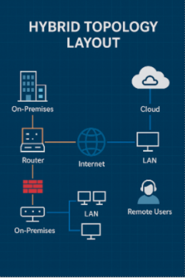
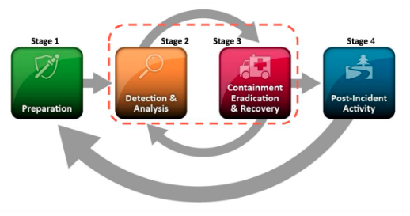
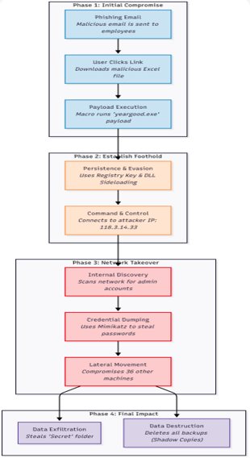

### SecGuru National Security Defense Plan
### Description & Goal
This project was a comprehensive, cross-functional academic exercise designed to create and validate a robust security architecture for a fictional national security organization, "SecGuru." The primary goal was to design a defense-in-depth strategy for a hybrid on-premises and cloud environment and then test its resilience against a realistic, multi-stage cyber-attack. As the Red/Blue Simulation Lead, my specific goal was to emulate an advanced adversary to identify critical vulnerabilities in the organization's detection and response capabilities.

### Implementation Steps or Workflow
The project was executed in several distinct phases, moving from design to implementation and finally to validation.

1.  **Infrastructure Design:** Developed a hybrid network topology combining on-premises systems with cloud infrastructure, segmenting the network into a DMZ, an Internal Zone, and a restricted Admin Zone.

2.  **Defense Strategy:** Implemented a layered defense model using next-generation firewalls, IDS/IPS, secure VPN access with MFA, and Role-Based Access Control (RBAC).

3.  **Policy & Playbook Development:** Co-authored key strategic documents, including:

  - **Incident Response Playbook:** Outlined a five-phase (Detection, Containment, Eradication, Recovery, Lessons Learned) response structure.

  - **Disaster Recovery Plan (DRP):** Created a plan for data backup and infrastructure failover based on the 3-2-1 rule and a warm site cloud model.

4.  **Red vs. Blue Team Simulation:** As the Red/Blue Simulation Lead, I designed and executed a simulated attack based on the MITRE ATT&CK framework.
  - **Red Team Actions:** Performed initial access via a phishing email with a malicious macro, established persistence using registry keys, dumped credentials with Mimikatz, and moved laterally via RDP to compromise 36 other machines.
  - **Blue Team Monitoring:** The defensive team was tasked with detecting and responding to the attack using a SIEM and other monitoring tools.

5.  **Analysis & Recommendations:** Analyzed the results of the simulation to identify security gaps and co-authored the final report detailing actionable recommendations to harden the organization's security posture.

### Screenshots, Diagrams, or Outputs

### Network Topology Diagram

### Incident Response Lifecycle

### Red Team Attack Path

### 🧰 Tools & Skills Used
- **Offensive Tools:** Mimikatz, Malicious Macro Payloads

- **Defensive & Monitoring Tools:** Splunk (SIEM), IDS/IPS, Firewalls, Wireshark, Windows Defender

- **Frameworks:** MITRE ATT&CK, NIST Cybersecurity Framework (CSF)

- **Skills:** Red Team/Blue Team Simulation, Incident Response Planning, Disaster Recovery Planning, Threat Intelligence Integration, Network Segmentation, Vulnerability Assessment, Technical Writing & Reporting.

### 🧠 Reflection & Takeaways
This project was an invaluable experience in bridging the gap between theoretical security architecture and practical, real-world defense. Leading the Red Team simulation provided critical insights into an attacker's mindset and highlighted how quickly a single point of failure—like a successful phish—can escalate into a full network compromise.

The key takeaway was the absolute necessity of a layered defense. While our Blue Team successfully detected lateral movement using the SIEM, the initial breach succeeded due to gaps in email filtering and a lack of MFA on privileged accounts. This reinforced that technical monitoring must be supported by strong foundational policies like least privilege access and a robust user security awareness program. This project solidified my understanding of how to build, test, and iteratively improve a comprehensive security program.
